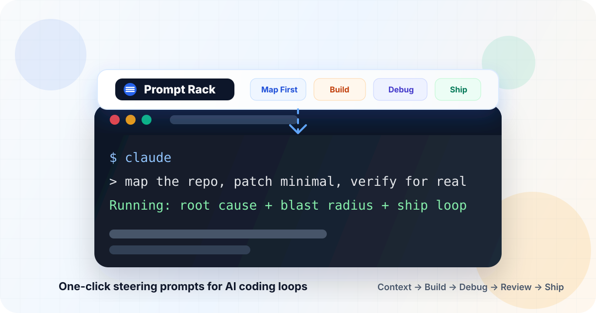
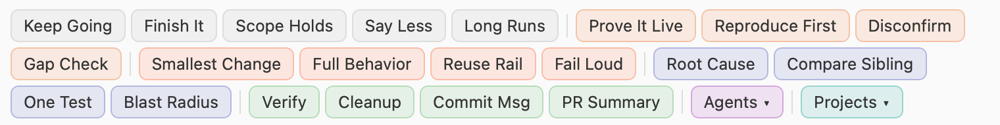

# Prompt Rack: one-click prompt buttons for Claude Code and Codex

<p align="center">
  
</p>

**What it is.** A small macOS app. It is a row of buttons that floats on top of your Terminal window. Each button holds a piece of text. Click the button and that text is typed into the Terminal window underneath, where Claude Code, Codex, or any other coding agent is running.

**Why it exists.** You type the same short corrections to your coding agent all day: keep going, prove it, do not change the scope, smaller change. Typing them by hand is slow and you forget. A button is one click and never forgets.

**How it helps.** The agent gets the correction the instant you notice the problem, in the exact words that work. Long commands go to the background on their own. Handing work to another model, or switching to another project, is one click from a menu.

**When to use it.** Any time you are steering a coding agent in Terminal. It is not for writing prompts from scratch; it is for the ones you already know you will type again.

## Starter Pack

<p align="center">
  
</p>

Current models already read the code first, find root causes, and review well on their own. What they still do is stop early, narrow the task to your last message, prove from the edit instead of the live path, and narrate instead of act. The default rack is built for that: short interrupts you would otherwise type under a running task.

| Category | Buttons |
|---|---|
| Steer | Keep Going, Finish It, Scope Holds, Say Less, Long Runs |
| Prove | Prove It Live, Reproduce First, Disconfirm, Gap Check |
| Build | Smallest Change, Full Behavior, Reuse Rail, Fail Loud |
| Debug | Root Cause, Compare Sibling, One Test, Blast Radius |
| Ship | Verify, Cleanup, Commit Msg, PR Summary |
| Agents (menu) | Opus, Sonnet, Fan Out, Codex, Fresh Review |
| Projects (menu) | Example, edit to your own |

Two categories render as menus instead of a row: **Agents** (hand work to Opus, Sonnet, Haiku fan-out, Codex, or a fresh-context reviewer) and **Projects** (switch the session to a project and load its context). Click the menu to expand its entries inline, click an entry to send it. Which categories are menus is the `menus` list in the rack JSON; edit the Projects entries to your own paths.

Any button can hold a slash command instead of a prompt (`/code-review`, `/compact`, `/review`), so the rack doubles as a launcher. Edit every button and combo from the built-in settings panel; existing racks keep their saved buttons, Reset loads this set.

## Auto-Background Long Commands

Claude Code shows "ctrl+b to run in background" under any Bash call that runs long, and you have to press it by hand, in the right tab, every time. Press **BG** on the rack once and Prompt Rack does it for you in every Claude session on the machine:

- a listener watches the Claude transcripts (event driven, no polling)
- a Bash call still running after 3.5 seconds gets sent to the background in its own Terminal tab
- nothing is focused, raised, or clicked
- a prompt you are halfway through typing is never submitted (the listener uses a chord, `ctrl+x enter`, bound to the background action)
- subagent shell calls are covered too

Requires `brew install fswatch`. BG installs a Claude Code SessionStart hook (so it knows which tab is which session), the chord in `~/.claude/keybindings.json`, and a launchd job. Sessions already open pick up the chord after a restart. Press BG again to unload the job. Its log, `~/.prompt-rack/auto-bg.log`, only ever holds failures.

## What Each Part Does

- **Buttons.** One click sends the button's text into the Terminal window under the rack. Hold Shift while clicking to stack several buttons, then send them together.
- **Combos.** A saved list of buttons. By default it sends as one message. Tick **one at a time** and set the seconds with **- +** to send each step as its own message, that many seconds apart. Build one in the Combo Builder: turn on capture, click buttons in order, save. **Done** in the title bar also saves the combo you have open.
- **Menus.** A category shown as one button that opens its entries. Tick the Menu box in the editor to make any category a menu.
- **Edit.** Opens the editor bar. Pick a category, type a label and the text, press Add. Click an existing button to change or delete it. Clear empties the fields for a new button.
- **Dock, arrows.** Dock snaps the rack onto the nearest Terminal window; the arrows put it on the top or bottom edge. The rack follows the front Terminal window as you switch, move, and resize.
- **BG.** Auto-background, described above.
- **Settings.** Theme, size, dock default, saved sets, and the rack JSON for import and export.

Hover any title-bar button to see what it does.

Your rack is saved as `~/Library/Application Support/Prompt Rack/state.json`. The first launch writes the starter pack there. Nothing leaves your machine.

## When Something Goes Wrong

Every error shows on the rack as a short message and is written, with its full detail, to `~/Library/Logs/Prompt Rack.log` (open it in Console.app). Nothing fails silently.

## Install

Download `Prompt-Rack.app.zip` from the [latest release](https://github.com/krushr1/claude-code-prompt-rack/releases/latest), unzip, and drag the app to Applications.

1. Open Terminal first. The rack docks to Apple Terminal and will not start without it.
2. Open Prompt Rack. The app is not notarized yet, so the first launch is right-click, Open.
3. macOS asks to let Prompt Rack use Accessibility; that is how it follows your Terminal window. Turn it on in System Settings > Privacy & Security > Accessibility, then open Prompt Rack again.

From source:

```bash
python3 -m pip install pyobjc
python3 app.py
```

The source run needs the same Accessibility switch for the app that launches it (Terminal).

## py2app Build

This is how the downloadable app in Releases is made.

```bash
python3 -m pip install pyobjc py2app setuptools
python3 setup.py py2app
```

## License

MIT
